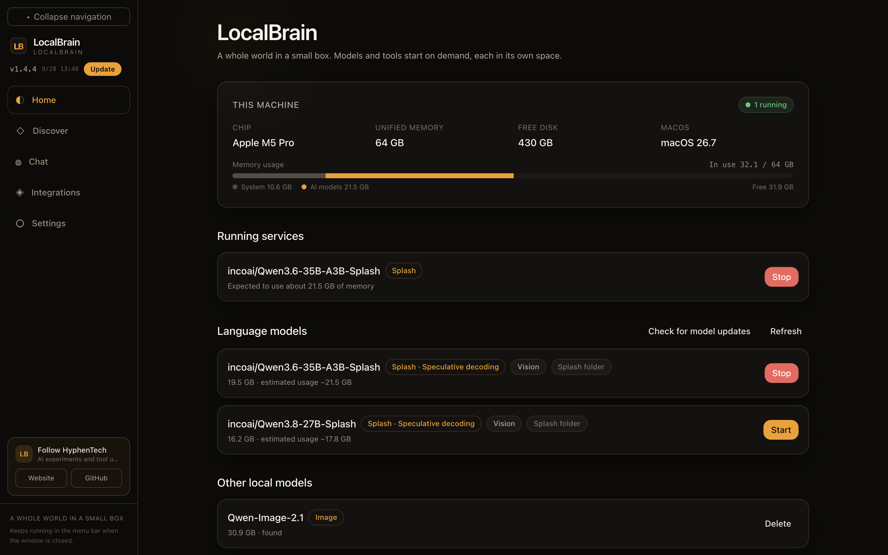
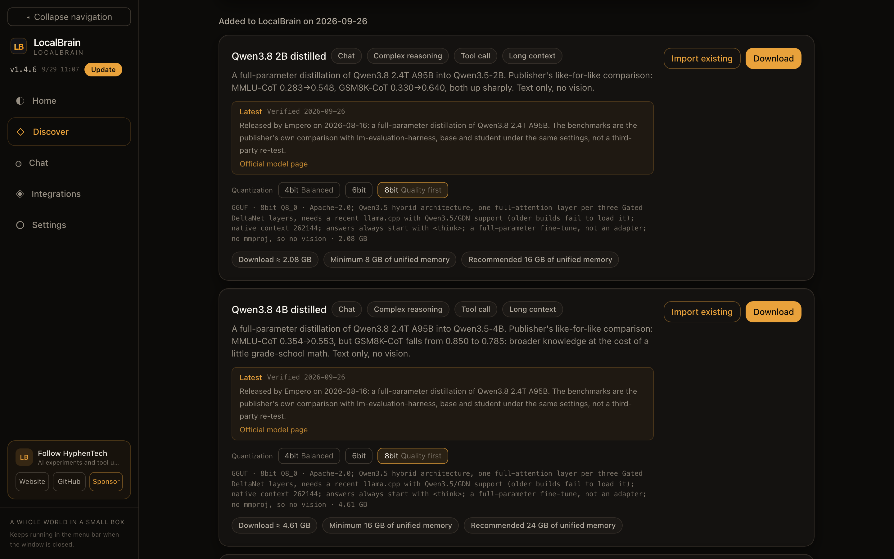
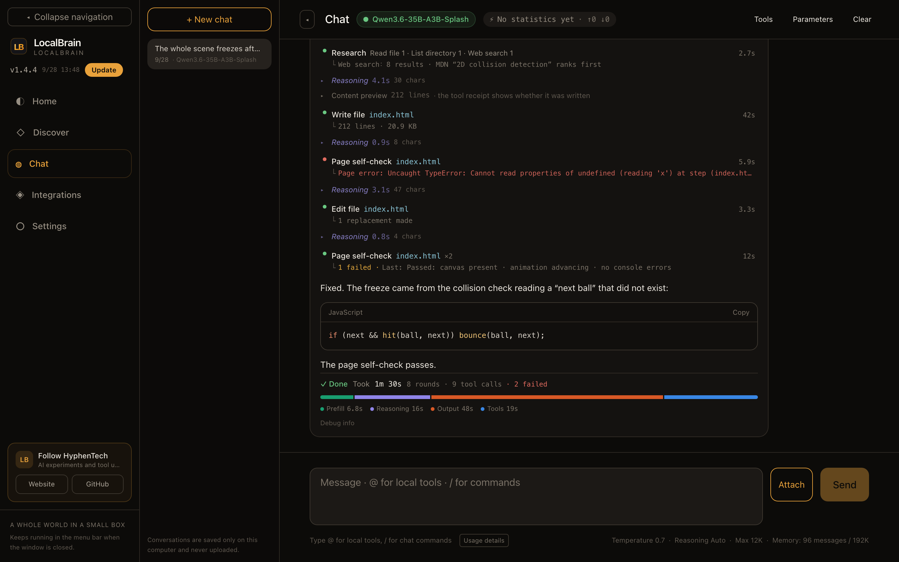
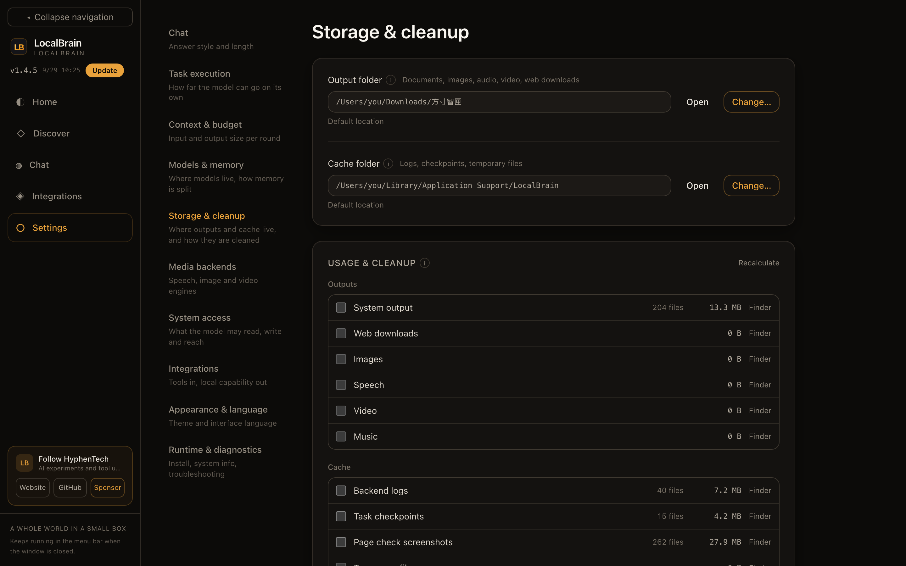
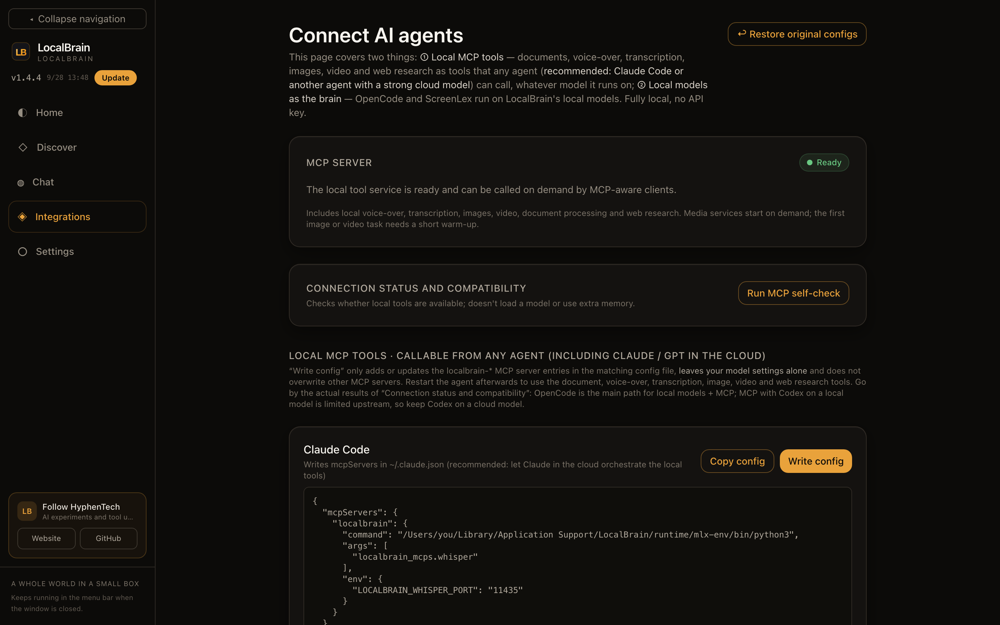

# LocalBrain

[简体中文](README.md) · [繁體中文](README.zh-TW.md) · **English**

A private AI workbench for your computer: download and manage local models, let a model read and write files, research the web and produce documents and media in a chat, and hand these local abilities to clients such as Claude Code, OpenCode and Codex.

[Website](https://hyphentech.top/localbrain) · [All releases](https://github.com/HackerChi-Hub/localbrain-releases/releases)



## Download

[Download Mac 1.4.8](https://github.com/HackerChi-Hub/localbrain-releases/releases/download/v1.4.8/LocalBrain_1.4.8_aarch64.dmg) · [Windows 1.4.4 downloads](https://github.com/HackerChi-Hub/localbrain-releases/releases/tag/v1.4.4)

Mac installer SHA-256: `1416f07243136206755892071810ab6cac661245b73182714fde7a1dc74bc143`

- **Mac: 1.4.8 (stable)** for Apple Silicon. The 1.4 series adds **Storage & cleanup**: generated files and caches can live anywhere (including an external drive) and be cleaned out completely; automatic cleanup runs on a background timer, so it also happens while the window is hidden. 1.4.3 removes the Simplified Chinese that was still showing in the English and Traditional Chinese interfaces. 1.4.4 makes “Import existing” on Discover check that the chosen folder really holds that model, lists broken registrations that point at folders that no longer exist on Home, and reviews about 1,400 English interface strings one by one. 1.4.5 adds a “Sponsor” entry in the sidebar and Settings that shows the WeChat sponsor code (WeChat Pay only); the English interface never shows an invitation on its own. From 1.4.6, generated images, video, audio and produced documents also count as completed tasks, and the invitation waits until the generation window is closed.
- **Windows: 1.4.4** remains the published installer. The next Windows package is built separately; the Mac version does not imply a Windows release.
- Updates can be checked and installed from inside the app; update packages are signature-checked.

## What it does

### This machine at a glance: a memory budget you can see

The home screen answers three questions: what this machine is, what is using memory right now, and what else you can start.

- **Hardware and memory**: chip, unified memory, free disk and OS version; the memory bar splits usage into "System" and "AI models" and states what is left.
- **Running services**: each backend shows its expected memory use and can be stopped at any time. When models compete for memory, an arbiter decides from the free memory whether another one may start.
- **Language models**: MLX, llama.cpp (GGUF) and Splash share one way of starting and stopping. Splash models bring their own draft model for speculative decoding; models that can read images are marked.
- **Media backends**: speech transcription, speech synthesis (with voice cloning), image generation, image editing, video generation and music generation, each started on demand and released automatically after idling or under memory pressure.

### Discover models: know whether it will run before you download



- **Curated catalog**: more than 40 entries across language, vision, speech, image, video and music models, newest first. Each card lists ability tags, the publisher's benchmark numbers with their source, the size of each quantization, and the minimum and recommended memory **worked out for this machine**.
- **Licenses up front**: restrictions stricter than usual, such as no commercial use, appear before the download button with a link to the original text.
- **Choice of download source**: ModelScope, HF-Mirror or Hugging Face; one click measures them and picks the fastest.
- **Mount models you already have**: point at a downloaded model folder and LocalBrain detects the engine, category and context ability, without copying weights or touching the folder.

### Chat and tasks: every step in plain view



When a model works on a concrete task, it calls tools step by step (complex tasks start with a plan), and the whole process is shown:

- **Tools**: read and list local files, search and read the web, write files and make targeted edits, run a web page self-check, and work with Word / Excel / PowerPoint / PDF. Before running a project command it asks every time, and says plainly that the working-directory limit is not a system sandbox.
- **Failures stay visible**: repeated calls to the same tool are grouped (for example "Page self-check ×2 · 1 failed") and the failure reason is kept. Above, the model's first self-check returned a page error; it added a null check and the next self-check passed.
- **Self-check**: generated web pages are checked in a headless browser for a canvas, advancing animation frames and console errors.
- **Where the time went**: each task ends with total time, rounds, tool calls and failures, with time split into prefill, reasoning, output and tools.
- **Context management**: the output limit and how much history to carry are set from the model's window and this machine's memory; older messages beyond the budget are folded into a summary, so a conversation does not grow without bound.

The conversation in the screenshots is demo content; hardware, models, sizes and folder usage come from the author's Mac (M5 Pro · 64 GB).

### Storage & cleanup: no hidden usage



- **Both folders can move**: the output folder holds generated documents, images, speech, video, music and web downloads; the cache folder holds logs, task checkpoints, check screenshots and temporary files. Either can live anywhere, including an external drive.
- **Moving takes the files along**: on the same drive they are moved directly; across drives they are copied and verified first, then the old copies go to the Trash.
- **Usage and cleanup per category**: to the Trash by default, or deleted permanently if you choose; folders sent to the Trash are named after where they came from.
- **Automatic cleanup**: total log size, checkpoint age and temporary file age each have a threshold; the app applies them on a background timer, window open or not.

### Connect other AI clients



- **Local MCP tools**: document processing, speech transcription, speech synthesis, images, video and web research as tools, written into the configuration of Claude Code, OpenCode, Codex or DeepSeek Harness with one click. Only the `localbrain-*` entries are added or updated; your model settings and other MCP servers stay as they are, and one click restores the configuration from before.
- **Local models as the brain**: OpenCode, ScreenLex and DeepSeek Harness can use local models directly through the OpenAI-compatible endpoint on this machine (`127.0.0.1:11434/v1`), fully local, no API key.
- **Self-test**: checks that the MCP protocol and tool discovery work, without loading a model or using extra memory.

### Also

- **Prompt templates**: 8 for images (portrait, product, transparent background, local edit, scene swap, person + product, Chinese poster, mixed Chinese/English) and 5 for video (landscape camera move, everyday close-up, first frame, first and last frame, multiple references), each marking what to change, how many reference images it needs and the reference time on this machine.
- **Document workbench**: DocFactory reads, creates and edits DOCX, PPTX, XLSX and PDF, with template filling and preview checks.
- **Three interface languages**: Simplified Chinese, Traditional Chinese and English, or follow the system; only the interface is translated, never your conversations, model answers, code or file paths.
- **Extensible**: add local stdio MCP servers you trust; four interface themes.

## Platform differences

| Feature | Apple Silicon Mac | Windows x64 |
|---|---|---|
| Language models | MLX / llama.cpp (Metal) / Splash | llama.cpp (CUDA / CPU) |
| Chat, web and document tools | Supported | Supported |
| Image generation (torch / diffusers) | Supported (MPS) | Supported (CUDA), runtime about 3 GB |
| Speech / video / music backends | Supported models only | Not supported; entries hidden |
| Storage & cleanup | From 1.4.0 | From 1.4.4 |

Finding model files does not mean their architecture is supported; results depend on the model, quantization, runtime and hardware.

## Getting started

1. Download the installer for your platform. On Mac, drag the app into Applications; on Windows, run the installer.
2. In Settings, install the runtimes you need and choose the interface language, model folder and download source.
3. In Discover, download a suitable model or mount a model folder you already have.
4. Start a language model on Home and use it in Chat; connect other clients under Integrations.

## Privacy and network

Inference runs on this machine and conversations are saved only on this computer. Downloading models, installing runtimes, checking for updates and web research need the network; only external model folders you add yourself are read; switching the interface language never sends conversations to a translation service.

## Development

This repository only hosts installers and documentation. The commands below are for developers with access to the source; they do not run in this download repository.

React / TypeScript / Vite frontend with a Tauri / Rust desktop layer.

```bash
npm install
npm test
npm run build
npm run tauri:dev
```

Mac: `npm run package`. Windows: run `npm run package:win` on Windows. Before releasing, check the installers, signatures, live downloads and per-platform update manifests.

Dictionaries live in `src/locales/` and cover display text only; they never change prompts, tool arguments or user content.

## License

Proprietary software. Models follow their own licenses; the app download contains no model weights. © HyphenTech.
