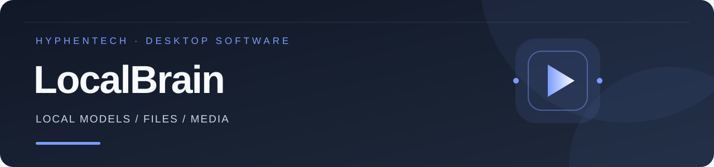

<!-- evergreen:intro:start -->

# LocalBrain · Local AI models, file tools and media workspace

Run supported local models, work with authorized files, and manage speech, image, video and music tasks in one desktop application by HyphenTech. Models plan and call tools; the app retains real execution receipts. Apple Silicon Mac integrates MLX, Metal llama.cpp, Splash and Prism; Windows uses adapted llama.cpp / Prism; Linux is preview support.

<a href="README.md">简体中文</a> | <a href="README.zh-TW.md">繁體中文</a> | <a href="README.en.md">English</a>

 

<!-- evergreen:intro:end -->

<!-- recent-features:start -->
## Recent features and improvements (5 items)

- **1.7.6** · On Windows, confirmation opens the official Docker Desktop installer through WinGet; existing installations are started while the app waits for the Linux engine.
- **1.7.6** · Setup distinguishes missing Docker, an unavailable engine and Windows-container mode; cancellation stops preparation and offline container lists no longer appear as refresh failures.
- **1.7.5** · Built-in labs reuse cached images; sandbox DNS can recover automatically, with network and architecture errors distinguished.
- **1.7.4** · A dedicated Security workspace groups workspace review, built-in labs, authorized hosts and container images by task.
- **1.7.4** · Settings are more compact; security resources load independently and previous errors are distinct from current status.
<!-- recent-features:end -->

<!-- evergreen:demos:start -->
## ▶ Watch a practical demo

**Starting local models, longer tasks and actual delivery**

| Bilibili | YouTube |
| :---: | :---: |
|  |  |

These videos show the versions available when recorded. Use the current release information on this page for downloads and capabilities. Narration is in Chinese.
<!-- evergreen:demos:end -->

## Latest downloads: Windows and Linux Debian 1.7.6; Mac 1.7.5

| Platform | Package and acceptance |
| --- | --- |
| Apple Silicon Mac 1.7.5 | [DMG](https://github.com/HackerChi-Hub/localbrain-releases/releases/download/v1.7.5/LocalBrain_1.7.5_aarch64.dmg), disk image and signature verified; installed app matches the build and launches; not Apple-notarized |
| Windows x64 | [Installer](https://github.com/HackerChi-Hub/localbrain-releases/releases/download/v1.7.6/LocalBrain_1.7.6_x64-setup.exe), built on Windows; packaged resources and updater signature verified; post-install UI and model acceptance remain pending |
| Linux x64 | [Debian package](https://github.com/HackerChi-Hub/localbrain-releases/releases/download/v1.7.6/LocalBrain_1.7.6_amd64.deb), built and installed on Ubuntu 22.04 WSL; passed a 20-second startup check; preview support, with real desktop and model acceptance pending; no AppImage for this release |

[1.7.6 release notes and checksums](https://github.com/HackerChi-Hub/localbrain-releases/releases/tag/v1.7.6). Drag the Mac app into Applications; on Debian/Ubuntu run `sudo apt install ./LocalBrain_1.7.6_amd64.deb`. Older releases are retained.

See the [1.7.6 verification record](VERIFICATION-1.7.6.md). Windows adds confirmed Docker Desktop installation, startup waiting and status guidance; the complete installation and model-checking workflow is not yet tested end to end. Linux remains a Debian preview package. This release uses the previously verified format and provides no AppImage; its updater retains 1.7.2. Install the Debian package manually to upgrade.

<!-- evergreen:screenshots:start -->
## Real application screenshots

Existing public macOS screenshots from version 1.4.6 show model management and client integration in Simplified Chinese. They are historical screenshots, not images of the latest release. Models and memory values reflect the captured session.

<!-- evergreen:screenshots:end -->

<!-- evergreen:capabilities:start -->
## Features and usage

Local model downloads/import/start/stop; streaming chat, attachments, reasoning controls, hardware-aware context budgets and task recovery; authorized files, project tests, documents and web tools; integrated media workbenches, MCP, local model APIs, storage management and three UI languages. Media controls depend on the model; laughter, precise pauses and multiple reference images are not universal capabilities.

1. Start a tool-capable model and open network-security settings.
2. Select a built-in lab, your host/service or your container.
3. Select a target and model execution or a direct check; review and confirm the scope.
4. The environment is prepared automatically. Model tools use native approval and return evidence; maintenance is collapsed by default.

Only inspect owned or explicitly authorized targets. Host grants bind to the reviewed address and ports, without scope expansion. Current coverage centers on TCP, plaintext HTTP and restricted exposure checks, not unrestricted scanning or exploitation. A working-directory restriction is not an OS sandbox, and image auditing is not a full assessment of a running application.

## Platforms and privacy

Mac supports integrated MLX, Metal llama.cpp, Splash and Prism. Windows uses adapted llama.cpp/Prism, without MLX/Splash. Linux is a recent preview: managed llama.cpp/Prism downloads are not fully wired, and MLX/Splash are unavailable. Build success does not establish native-device acceptance.

Local inference does not require sending conversations to the cloud; downloads, dependencies, updates, web tools and external services can use the network. Model weights are not bundled and retain separate licenses.
<!-- evergreen:capabilities:end -->

## SHA-256

| File | Hash |
| --- | --- |
| Mac DMG | `a7e76084cdbcad77c424d79f13dfb868976f16460aee6d37a854940b8d0515dc` |
| Windows installer | `e593eb820bdfc9588b4efc62ec17a19a71bfc90fac6b1a84a04a8506d0805389` |
| Linux Debian | `8fd14a5b1a88131d4a9e8dc5e4444e68d706eec1468c71588f99ce91756fee6d` |

This repository provides installers and documentation, not development source. Proprietary software, © HyphenTech.

<!-- evergreen:use-cases:start -->
## Common questions

**Can I use local AI without sending conversations to the cloud?** Local inference can stay on your computer. Downloads, updates, web tools and external services may still use the network.

**Is every model suitable for file or Office tasks?** No. Use a model that supports the required tools; inspect execution receipts and resulting files. A model's statement alone is not proof that a task succeeded.

**Do all platforms have the same features?** No. Check the platform notes and release acceptance status above. Linux remains preview support.

**How does it fit with other HyphenTech apps?** LocalBrain runs local models; HyphenBox manages provider APIs; ScreenLex handles movie-based English learning; HyphenScreen records and edits tutorials.
<!-- evergreen:use-cases:end -->

<!-- evergreen:discovery:start -->
## More HyphenTech software

Local models: [LocalBrain](https://github.com/HackerChi-Hub/localbrain-releases). Screen tutorials: [HyphenScreen](https://github.com/HackerChi-Hub/HyphenScreen-Releases). Movie English: [ScreenLex](https://github.com/HackerChi-Hub/screenlex-download). API discovery and routing: [HyphenBox](https://github.com/HackerChi-Hub/hyphenbox-release). Share this repository homepage so others can choose the latest package for their system.
<!-- evergreen:discovery:end -->
