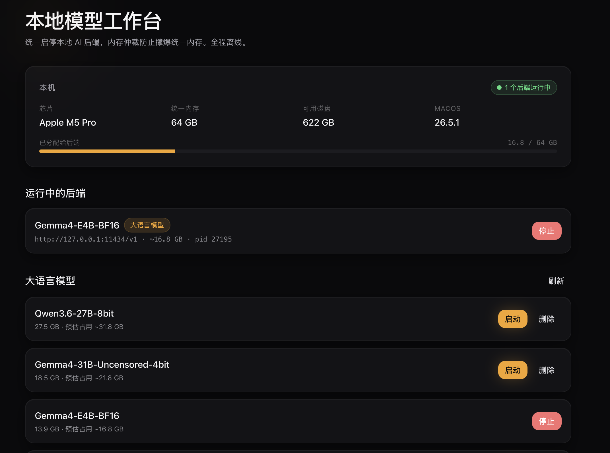
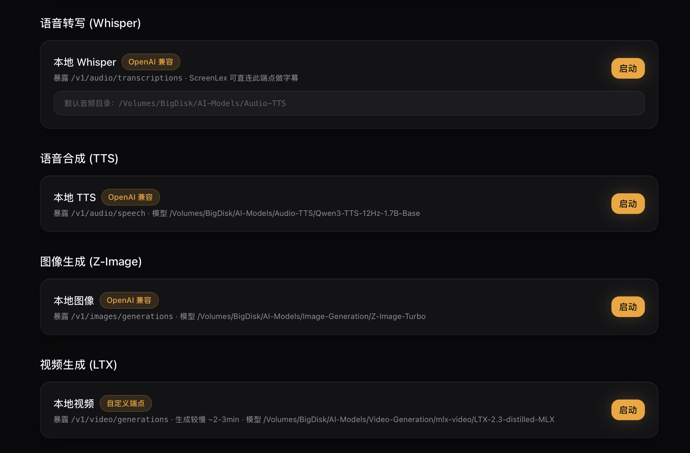
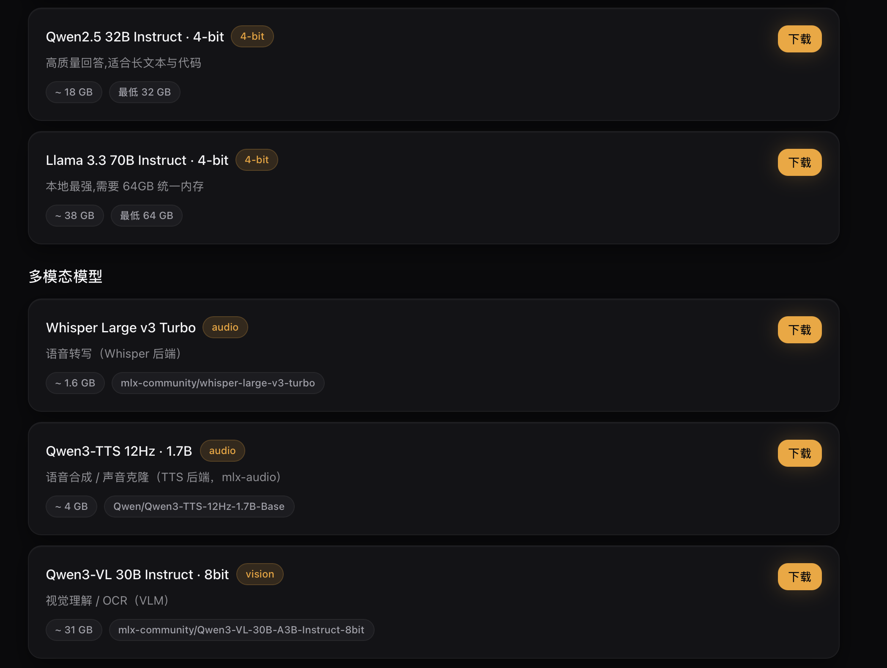
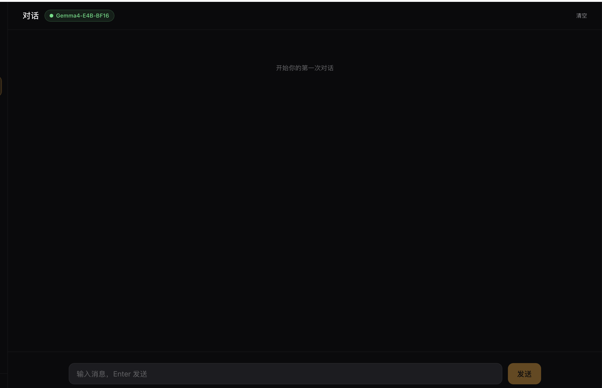
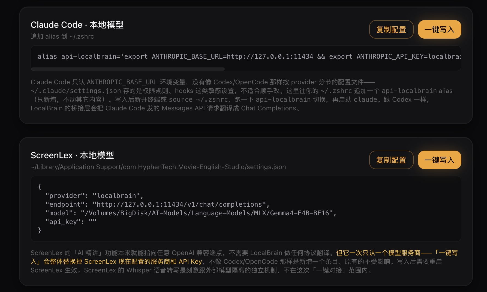
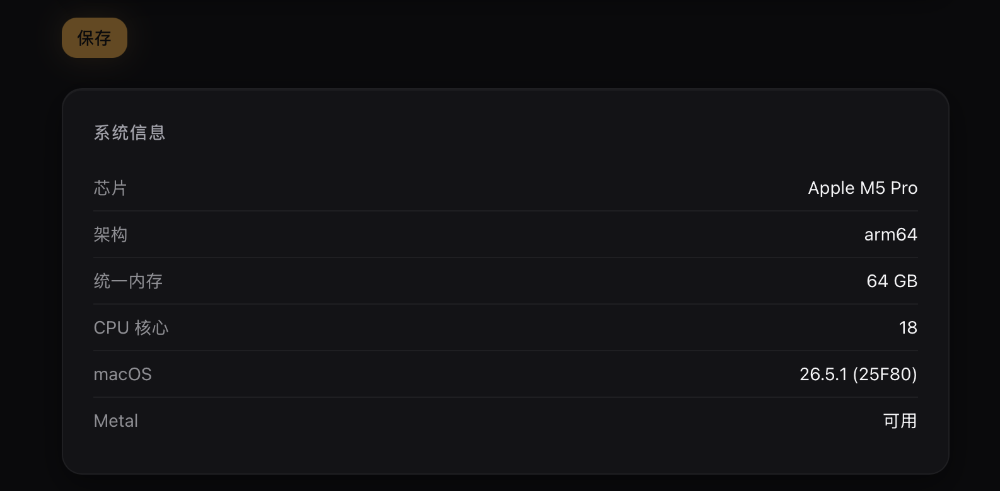

# LocalBrain

LocalBrain 是黑粉科技 HyphenTech 出品的本地 AI 工作台：一键管理 Apple Silicon 上的本地 MLX 模型（大语言模型、语音转写、语音合成、图像生成、视频生成、视觉理解），统一暴露成 OpenAI 兼容接口，并能一键接入 Codex、OpenCode、Claude Code、ScreenLex 等工具。**全程离线，模型和数据不出本机。**

> 本仓库仅用于发布安装包与说明，不包含源代码。

## 下载

前往 **[Releases](https://github.com/HackerChi-Hub/localbrain-releases/releases/latest)** 下载最新 DMG，或直接用仓库里的 `LocalBrain-latest.dmg`。

要求：macOS，Apple Silicon（M1 及以上）。

## 快速开始

1. 下载 DMG，把 `LocalBrain.app` 拖进「应用程序」
2. 打开后会自动检测硬件（芯片、统一内存），推荐适合的模型
3. 去「发现」下载一个模型（内置 ModelScope / HF-Mirror / HuggingFace 官方三个源，自动测速选最快）
4. 回「主页」点「启动」，模型就绪后去「对话」直接聊，或者在「集成」页一键接进你已有的开发工具

## 主要功能

### 本地模型工作台
- 统一启停大语言模型、Whisper 语音转写、TTS 语音合成、Z-Image 图像生成、LTX 视频生成、视觉理解（VLM）等本地后端
- 内存仲裁：启动前估算所需内存，防止把统一内存撑爆
- 每种模型类型可分别指定安装/扫描目录，换盘换机不用重新配置
- 自带 Python 运行时（python-build-standalone + 隔离 venv），不依赖系统环境，全新 Mac 也能直接用

### 模型下载
- 三个下载源自动测速选最快：ModelScope 魔搭（国内）、HF-Mirror 国内镜像、HuggingFace 官方
- 精选适配本机内存的模型推荐

### OpenAI 兼容 API
- 本地服务监听 `http://127.0.0.1:11434/v1`，标准 Chat Completions 格式，任何 OpenAI 兼容客户端都能直接用

### 一键接入 AI Agent / 开发工具
- **Codex**：Codex CLI 的本地模型模式只认 OpenAI 的 Responses API，LocalBrain 内置一层轻量翻译桥接，让 Codex 能像用 Ollama 一样驱动本地 MLX 模型（包括工具调用）
- **OpenCode**：原生说 Chat Completions，直连无需翻译
- **Claude Code**：翻译 Anthropic Messages API，往 `~/.zshrc` 追加一个切换用的 alias
- **ScreenLex**（本地影视英语学习软件）：一键把 AI 精讲/翻译/校对切到本地模型，无需任何云端 API Key
- 以上均支持「一键写入」直接改配置文件，或「复制配置」自己手动粘贴
- 内置 MCP 服务器，把 Whisper 语音转写等本地多模态能力暴露成 MCP 工具，供 Claude Code / Codex / OpenCode 直接调用

### 内置对话
- 流式响应，可随时中断

## 截图

## 安装提示

当前版本尚未进行代码签名与公证。若提示「无法验证开发者」，右键点 `LocalBrain.app` →「打开」，或在「系统设置 → 隐私与安全性」中允许打开。

## 说明

LocalBrain 为闭源发布软件。本公开仓库仅用于发布安装包与说明，不包含源代码。
