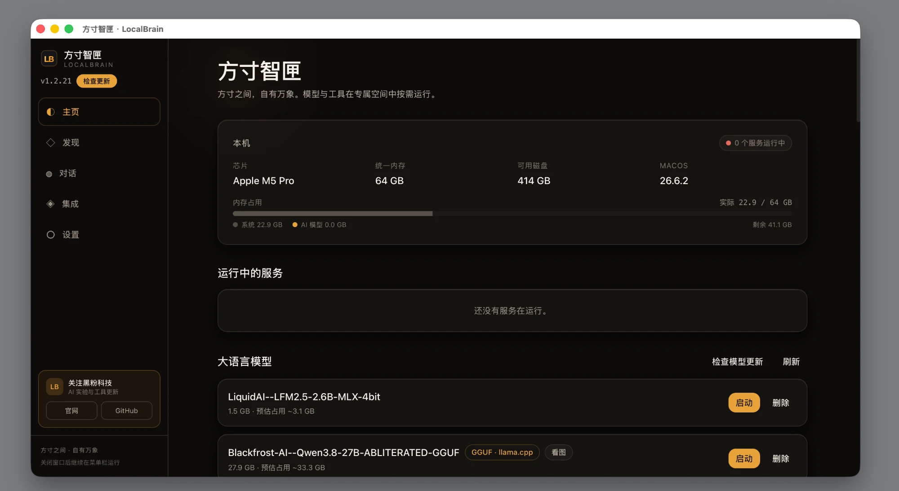
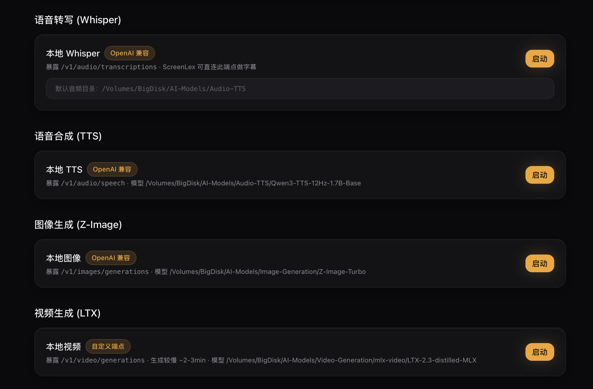
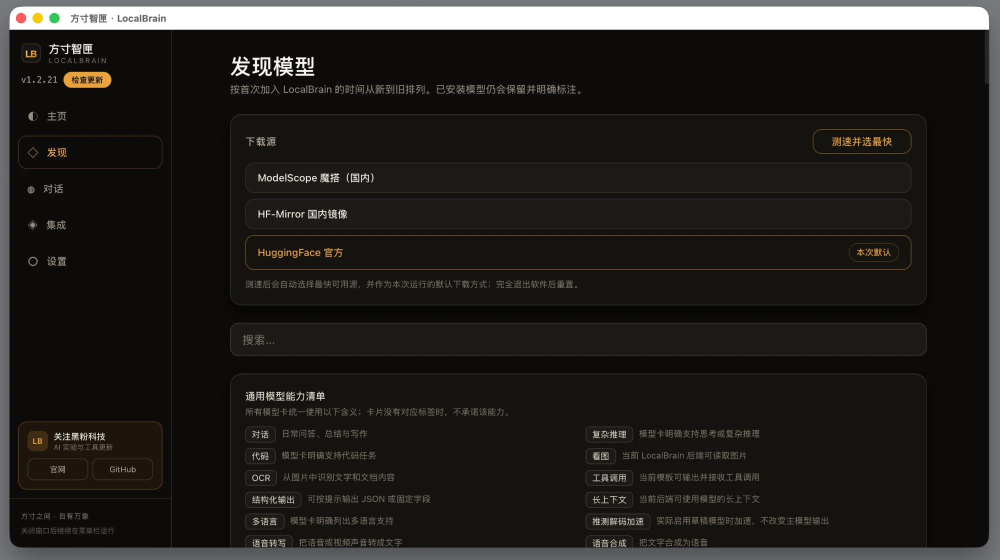
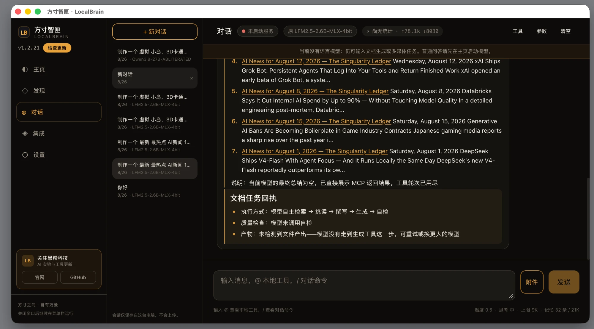
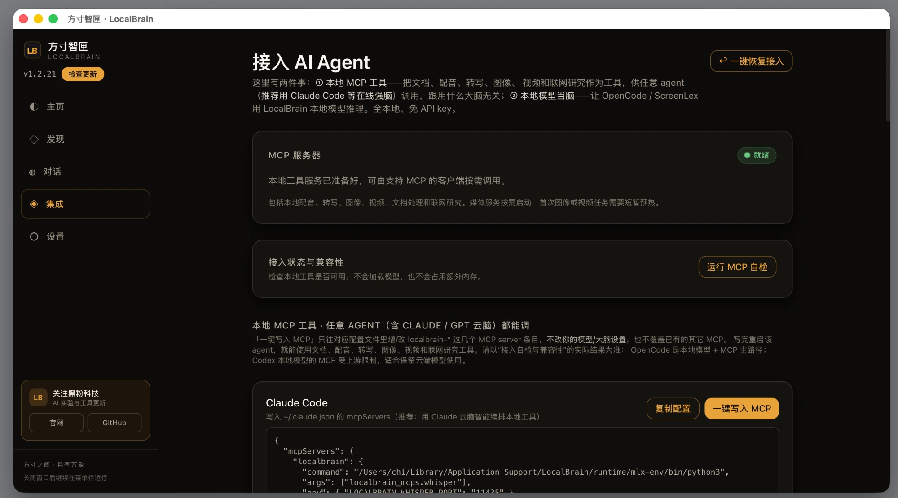
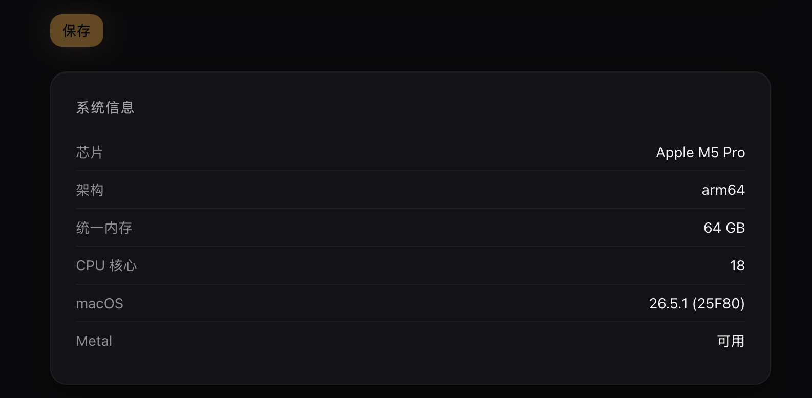

# LocalBrain

LocalBrain（中文名：方寸智匣）是黑粉科技 HyphenTech 出品的 Mac 本地 AI 工作台：统一管理本地大语言模型、视觉理解、语音转写、语音合成、图像、视频、音乐和图片编辑后端，并提供 OpenAI 兼容接口、内置对话和本地工具调用。

> 当前稳定版：**1.2.0**。本仓库只保留最新公开版本的下载入口。

## 下载

前往 **[Releases](https://github.com/HackerChi-Hub/localbrain-releases/releases/latest)** 下载最新 DMG。已安装的旧版会自动收到更新。

当前安装包：`LocalBrain_1.2.0_aarch64.dmg`

SHA-256：`248195a9b57c5abef36604469a5eb2f83f572138daf88ced50cdfe9277e28c3e`

要求：macOS，Apple Silicon（M1 及以上）。

## 快速开始

1. 下载 DMG，把 `LocalBrain.app` 拖进「应用程序」
2. 打开后会自动检测硬件（芯片、统一内存），推荐适合的模型
3. 去「发现」下载一个模型（内置 ModelScope / HF-Mirror / HuggingFace 官方三个源，自动测速选最快）
4. 回「主页」点「启动」，模型就绪后去「对话」直接聊，或者在「集成」页一键接进你已有的开发工具

## 主要功能

### 本地模型工作台
- 统一启停大语言模型、Whisper 语音转写、TTS 语音合成、Z-Image 图像生成、MiniMax H3 视频生成（自带音轨）、音乐生成、图片编辑、视觉理解（VLM）等本地后端
- 内存仲裁：启动前估算所需内存，防止把统一内存撑爆
- 每种模型类型可分别指定安装/扫描目录，换盘换机不用重新配置
- 自带 Python 运行时（python-build-standalone + 隔离 venv），不依赖系统环境，全新 Mac 也能直接用

### 模型下载
- 三个下载源自动测速选最快：ModelScope 魔搭（国内）、HF-Mirror 国内镜像、HuggingFace 官方
- 已有模型可直接「引用」进模型库，不重复下载；删除模型会连带清掉指向它的配置

### 文档任务（对话里直接下单）
- 在对话里说「搜索今天的 XX 新闻做成 PPT」这类需求，本地模型自主完成 检索 → 挑读 → 撰写 → 生成 → 自检 全流程，产出可编辑的 PPTX / DOCX / XLSX / PDF
- 全程可视：思考实时展开（完成后自动折叠）、树状执行记录、逐轮工具调用与产物回执
- 交付诚实：回执里的每个文件路径都真实存在；没产出就如实说，不会假装完成

### 视频生成（MiniMax H3）
- 纯文字、首帧参考、首尾帧参考三种方式，另有「分段拼接」把多组首尾帧串成超长视频（逐段生成后无损拼接，段数不限）
- 时长自由调节，版型 16:9 / 9:16 / 1:1 / 4:3 / 3:4 × 标准/高清；生成自带音轨
- 预估生成时间按本机真实耗时自动校准，生成中显示已用/剩余倒计时

### 模型库（1.2.0 更新）
- 新增「去审查 + 看图」组合：Qwen3.8 27B 去审查·视觉（与默认版同基座）、Qwen3-VL 30B / 8B 去审查视觉版
- 新增低配机档位：Gemma 4 E2B / E4B、Granite 4.0 H Micro，8GB 内存也能跑
- 每个模型可选 4 / 5 / 6 / 8bit 量化，按你的内存自动选好，只下载所选的那一档

### 界面（1.2.0 更新）
- 四套重新设计的配色：钨丝、曜石、纸墨（浅色）、磷光，设置里即时切换
- 回复长度自动按机器和模型定，不用手动调；写长代码不再中途被截断

### 本地系统工具（1.1.0 新增）
- 对话里模型可以浏览/读取/搜索你允许的目录（默认 下载/文稿/桌面，设置里可改），把笔记和结果写进专属输出文件夹（只新建、永不覆盖）
- 没有终端、没有删除——能力面刻意有界

### 界面与体验
- 四款主题即时切换：暖金暗夜 / 曜石冷蓝 / 纸墨浅色 / 磷光终端
- 任何生成完成都会弹出右下角通知（可直接打开文件 / 在访达显示 / 填入对话框），不会被弹窗挡住
- 对话底栏实时显示本会话累计 token（输入 / 输出 / 合计）

### OpenAI 兼容 API
- 本地服务监听 `http://127.0.0.1:11434/v1`，标准 Chat Completions 格式，任何 OpenAI 兼容客户端都能直接用

### 一键接入 AI Agent / 开发工具
- **Codex**：提供 Responses API 翻译桥接；本地模型能否稳定调用第三方 MCP 工具仍取决于 Codex 客户端与所选模型
- **OpenCode**：原生说 Chat Completions，直连无需翻译
- **Claude Code**：翻译 Anthropic Messages API，往 `~/.zshrc` 追加一个切换用的 alias
- **ScreenLex**（本地影视英语学习软件）：一键把 AI 精讲/翻译/校对切到本地模型，无需任何云端 API Key
- 以上均支持「一键写入」直接改配置文件，或「复制配置」自己手动粘贴
- 内置 MCP 服务器，把 Whisper 语音转写等本地多模态能力暴露成 MCP 工具，供 Claude Code / Codex / OpenCode 直接调用

### 内置对话
- 流式响应、Markdown、代码复制、多行输入、停止、重试、会话持久化和参数自动优化
- 支持 DOCX、PPTX、XLSX、PDF、常用文本与代码、图片、音频和视频附件
- 附件读取与当前问题在同一轮发送；读取尚未结束时自动排队，完成后继续回答
- Muse Glimmer 等带 `mmproj` 的 GGUF 视觉模型直接接收图片，不再额外启动独立视觉模型；纯文本模型仍按需回退 VLM
- 对话生成过程中可切换主页、发现、集成或设置；请求会在后台继续，侧边栏提供返回入口
- 可按需调用文档处理、语音、图像、视频、音乐和图片编辑等本地工具

## 截图













## 安装提示

当前安装包使用开发签名，尚未完成 Apple 公证。若系统阻止首次打开，可先把应用拖入「应用程序」，再执行：

```bash
xattr -dr com.apple.quarantine /Applications/LocalBrain.app
```

## 说明

公开下载库和 Releases 只保留最新版本。问题反馈请开 Issue。
