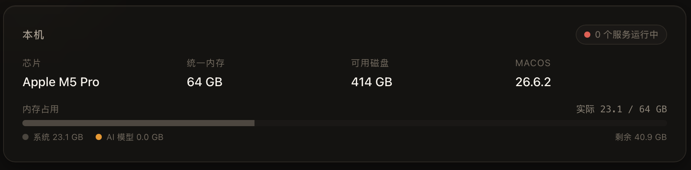
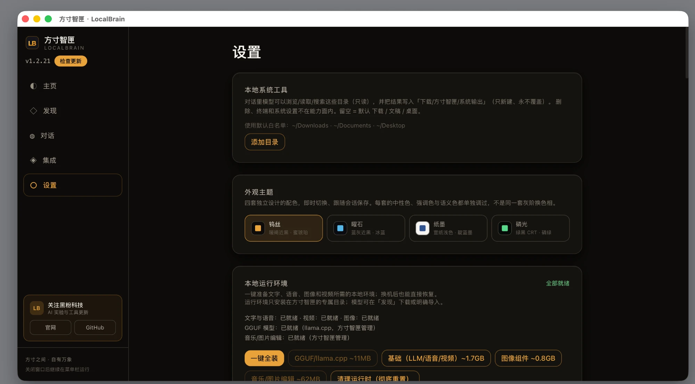

# LocalBrain

LocalBrain（中文名：方寸智匣）是黑粉科技 HyphenTech 出品的本地 AI 工作台（macOS Apple Silicon，以及 Windows NVIDIA 显卡首版预览）：统一管理本地大语言模型、视觉理解、语音转写、语音合成、图像、视频、音乐和图片编辑后端，并提供 OpenAI 兼容接口、内置对话和本地工具调用。

> 当前版本：macOS **1.2.69**；Windows **1.2.68**。两个平台独立更新。

## 下载

Windows 下载 [1.2.68 安装包](https://github.com/HackerChi-Hub/localbrain-releases/releases/download/v1.2.68/LocalBrain_1.2.68_x64-setup.exe)；Mac 下载 [1.2.69 DMG](https://github.com/HackerChi-Hub/localbrain-releases/releases/download/v1.2.69/LocalBrain_1.2.69_aarch64.dmg)。已安装的应用按各自平台接收更新。

当前安装包：`LocalBrain_1.2.69_aarch64.dmg`

SHA-256：`646c2d66cbc9f8176bff94f6743a23246dbfbebca8db2e3fe38ddc3d2d2856ee`

要求：macOS，Apple Silicon（M1 及以上）。

### Windows

当前安装包：`LocalBrain_1.2.68_x64-setup.exe`

SHA-256（Windows 安装包）：`910eab5021c1707f5384a3ec42a63fa8648c7737a7910d2923e1f6a3b41a1e9c`

要求：Windows 10 1803+ / Windows 11 x64；NVIDIA 显卡，驱动 527.41 或更新（没有 NVIDIA 显卡时自动改用 CPU 版，明显更慢）；16 GB 内存起。

Windows 版包含本地文本模型与全部本地工具（文档、联网、系统文件、网页自检）。语音转写、语音合成、图像、视频、音乐后端目前只在 macOS 提供，Windows 版不显示这些入口。**应用内自动更新已可用**（与 macOS 同一套更新器签名）：装好之后新版本会自己提示并安装。**仍未做代码签名**，首次安装时 SmartScreen 会提示「更多信息 → 仍要运行」。装好后到「设置 → 本地运行环境 → 一键全装」，程序会按显卡和驱动自动选 CUDA 版或 CPU 版推理引擎并说明理由。

## 1.2.69 第二代三值模型（苹果芯片 Mac）

- 下载库新增 Bonsai 2 27B 三值 PQ2_0，替换第一代三值条目；一位版 Bonsai 保留。
- 纯文本约 7.21 GB，含视觉约 7.84 GB。支持对话、思考、编程、工具调用和图片理解；建议中档思考，不支持低档。
- 按权重元数据自动选择独立 PrismML 后端，自动准备运行环境并校验 SHA256，其他模型后端不变。
- 下载大小不等于运行内存，实际上下文按硬件规划。已做本机多轮对话、文件工具与图片识别测试，不保证任意复杂长任务一次成功。

## 1.2.68 长任务修复（已包含在新版）

- 显存限制上下文时，自动调整 GPU / CPU 层数，利用系统内存争取最多 32K 工作窗口；实际值仍由模型和内存预算、历史压力校准限制。
- 自动工具模式输入独立的“继续”，恢复最新未完成任务的原始需求、计划和工具回执。
- 没有真实成功工具回执时拒绝空交付，避免把未完成任务显示为完成。
- 保留 1.2.67 的外部 MCP、工具图片观察和 view_image 功能。继续任务与交付修复也已包含在 Mac 1.2.69 安装包中。

## 快速开始

1. 下载 DMG，把 `LocalBrain.app` 拖进「应用程序」
2. 打开后会自动检测硬件（芯片、统一内存），推荐适合的模型
3. 去「发现」下载一个模型（内置 ModelScope / HF-Mirror / HuggingFace 官方三个源，自动测速选最快）
4. 回「主页」点「启动」，模型就绪后去「对话」直接聊，或者在「集成」页一键接进你已有的开发工具

## 主要功能

### 本地模型工作台
- 统一启停大语言模型、Whisper 语音转写、TTS 语音合成、Z-Image 图像生成、MiniMax H3 视频生成（自带音轨）、音乐生成、图片编辑、视觉理解（VLM）等本地后端
- 内存仲裁：启动前估算所需内存，防止把统一内存撑爆
- 每种模型类型可分别指定安装/扫描目录，换盘换机不用重新配置
- 自带 Python 运行时（python-build-standalone + 隔离 venv），不依赖系统环境，全新 Mac 也能直接用

### 模型下载
- 三个下载源自动测速选最快：ModelScope 魔搭（国内）、HF-Mirror 国内镜像、HuggingFace 官方
- 已有模型可直接「引用」进模型库，不重复下载；删除模型会连带清掉指向它的配置

### 文档任务（对话里直接下单）
- 在对话里说「搜索今天的 XX 新闻做成 PPT」这类需求，本地模型自主完成 检索 → 挑读 → 撰写 → 生成 → 自检 全流程，产出可编辑的 PPTX / DOCX / XLSX / PDF
- 全程可视：思考实时展开（完成后自动折叠）、树状执行记录、逐轮工具调用与产物回执
- 交付诚实：回执里的每个文件路径都真实存在；没产出就如实说，不会假装完成

### 视频生成（MiniMax H3）
- 纯文字、首帧参考、首尾帧参考三种方式，另有「分段拼接」把多组首尾帧串成超长视频（逐段生成后无损拼接，段数不限）
- 多参考图（1.2.64 新增）：装上 REF2VA 模型后，一次加入最多 9 张人物、风格或场景图，顺序就是提示词里的 `<Picture 1…N>`，可一键套用官方六段式模板；与首尾帧模型并存，随时切换
- 时长自由调节，版型 16:9 / 9:16 / 1:1 / 4:3 / 3:4 × 标准/高清；生成自带音轨
- 预估生成时间按本机真实耗时自动校准，生成中显示已用/剩余倒计时

### 模型库与量化档位
- 「去审核 + 看图」组合：Qwen3.8 27B 去审核·视觉（与默认版同基座）、Qwen3-VL 30B / 8B 去审核视觉版
- 今年的低内存小模型（1.2.66 新增）：MiniCPM5 2B、Qwen3.5 4B / 9B、Granite 4.2 3B / 8B、Gemma 4 12B / E4B 官方量化感知训练版、Bonsai 27B 1-bit 与三值版；每个都在内置推理引擎上实测过对话与工具调用，卡片写明实测内存（如 MiniCPM5 2B 在 8K 上下文下约 1.98 GB），其中 6 个能看图，也可以只下纯文本档
- 低配机档位：Gemma 4 E2B / E4B、Granite 4.0 H Micro，8GB 内存也能跑
- 每个模型可选 4 / 5 / 6 / 8bit 量化，按你的内存自动选好，只下载所选的那一档
- 卡片直接标出技术规格：权重格式、位宽与量化算法、是否带视觉投影、体积
- 最低与建议内存按所选档位的体积推导，不是手填的固定值；1.2.66 起 Mac 按系统分给显卡的内存上限与推理引擎的启动余量计算，3.2 GB 以内的模型在 8GB Mac 上标「最低 8 GB」

### 已有模型直接用（不用重下）
- 把任意目录加进「外部模型库」，只读递归识别，不复制、不移动、不写标记
- **Ollama 模型库**：把 `~/.ollama/models` 加进来即按清单逐模型识别，条目名与 `ollama list` 一致，直接启动、零复制
- **LM Studio** 的模型目录（标准 HF 结构）直接兼容
- GGUF 按「扩展名 + 文件头」双重识别，改过名或无扩展名的权重同样能认
- 设置里列明识别范围，并如实标出「识别到不等于可启动」的边界

### 模型更新与下载稳定性
- 一键检查已装模型是否落后于上游，「更新」只重下变化的文件，未变的自动跳过
- 上游改名或换了量化方案时会单独提示，不会让你对着一个必失败的按钮反复点
- 大文件下载断流自动断点续传（指数退避重试），连接停滞自动重连；失败提示改成可行动的中文说明
- 下载完成按 SHA-256 校验；体积相同但内容不符的损坏文件会被丢弃重下

### 本地系统工具（1.1.0 新增）
- 对话里模型可以浏览/读取/搜索你允许的目录（默认 下载/文稿/桌面，设置里可改），把笔记和结果写进专属输出文件夹（只新建、永不覆盖）
- 没有终端、没有删除——能力面刻意有界
- 看图工具 `view_image`（1.2.67 新增）：模型可以直接打开刚生成或渲染出来的图片自己检查效果，不必只凭文字回执判断做没做对；只读允许目录内的文件，按文件头判断真实格式（PNG/JPEG/GIF/WebP），大图缩到最长边 1024 像素再返回，同时给出原始尺寸与 SHA-256

### 界面与体验
- 四套重新设计的配色即时切换：钨丝暖金 / 曜石冷蓝 / 纸墨浅色 / 磷光终端，四套都过可读性对比度校验
- 回复长度自动按机器和模型定，不用手动调；写长代码不再中途被截断
- 全局快捷键：⌘N 新建会话、⌘K 聚焦输入框、⌘, 打开聊天参数、Esc 停止生成
- 弹窗支持 Esc 关闭与 Tab 焦点循环，关闭后焦点归还原处
- 任何生成完成都会弹出右下角通知（可直接打开文件 / 在访达显示 / 填入对话框），不会被弹窗挡住
- 顶栏显示生成速度与本会话累计 token（含思考与工具调用），详细诊断数据收进悬浮说明

### OpenAI 兼容 API
- 本地服务监听 `http://127.0.0.1:11434/v1`，标准 Chat Completions 格式，任何 OpenAI 兼容客户端都能直接用

### 一键接入 AI Agent / 开发工具
- **Codex**：提供 Responses API 翻译桥接；本地模型能否稳定调用第三方 MCP 工具仍取决于 Codex 客户端与所选模型
- **OpenCode**：原生说 Chat Completions，直连无需翻译
- **Claude Code**：翻译 Anthropic Messages API，往 `~/.zshrc` 追加一个切换用的 alias
- **DeepSeek Harness（dsh）**：MCP 工具与本地模型两条链路都接；写完下一次请求即生效，不用先退出它
- **ScreenLex**（本地影视英语学习软件）：一键把 AI 精讲/翻译/校对切到本地模型，无需任何云端 API Key
- 以上均支持「一键写入」直接改配置文件，或「复制配置」自己手动粘贴
- 内置 MCP 服务器，把 Whisper 语音转写等本地多模态能力暴露成 MCP 工具，供 Claude Code / Codex / OpenCode 直接调用

### 内置对话
- 流式响应、Markdown、代码复制、多行输入、停止、重试、会话持久化和参数自动优化
- 每个会话标出它由哪个模型生成；中途换了模型会在切换处标注
- 生成过程中切换对话，内容仍归属发起它的那个对话，不会写错地方
- 模型写代码时实时预览，写入文件的长过程显示工具名、字符数与耗时，不再看着像卡死
- 支持 DOCX、PPTX、XLSX、PDF、常用文本与代码、图片、音频和视频附件
- 附件读取与当前问题在同一轮发送；读取尚未结束时自动排队，完成后继续回答
- Muse Glimmer 等带 `mmproj` 的 GGUF 视觉模型直接接收图片，不再额外启动独立视觉模型；纯文本模型仍按需回退 VLM
- 对话生成过程中可切换主页、发现、集成或设置；请求会在后台继续，侧边栏提供返回入口
- 可按需调用文档处理、语音、图像、视频、音乐和图片编辑等本地工具
- **接入外部 MCP 服务器（1.2.67 新增）**：在设置里粘贴 `mcpServers` 配置即可（OpenCode 的 `mcp` 段也认），点「测试」会真的启动一次并列出该服务器声明的工具，再逐项勾选要交给模型的工具——工具说明每一轮都占上下文，例如某个声明 28 个工具的服务器全勾是 30,062 字符，只勾三个是 2,723 字符。每次调用起独立进程组，停止或超时时整组结束，不留后台残留；只支持本机 stdio 服务器
- **模型能看见工具返回的图片（1.2.67 新增）**：工具返回图片、当前模型又支持看图时，会用一次单独的短请求让模型看一眼，把三行观察追加进这次的工具结果；图片不进对话历史，每次结果最多看 2 张

## 截图







## 安装提示

当前安装包使用开发签名，尚未完成 Apple 公证。若系统阻止首次打开，可先把应用拖入「应用程序」，再执行：

```bash
xattr -dr com.apple.quarantine /Applications/LocalBrain.app
```

Windows 安装包未签名，SmartScreen 会拦一次：点「更多信息 → 仍要运行」。安装到当前用户目录，不需要管理员权限。

## 说明

公开下载页优先展示各平台最新版本；仍被旧版更新清单引用的历史资产保留，避免更新链接失效。问题反馈请开 Issue。
