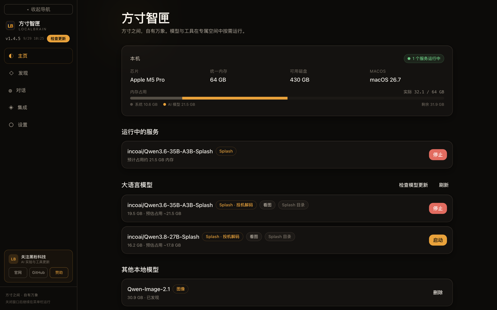
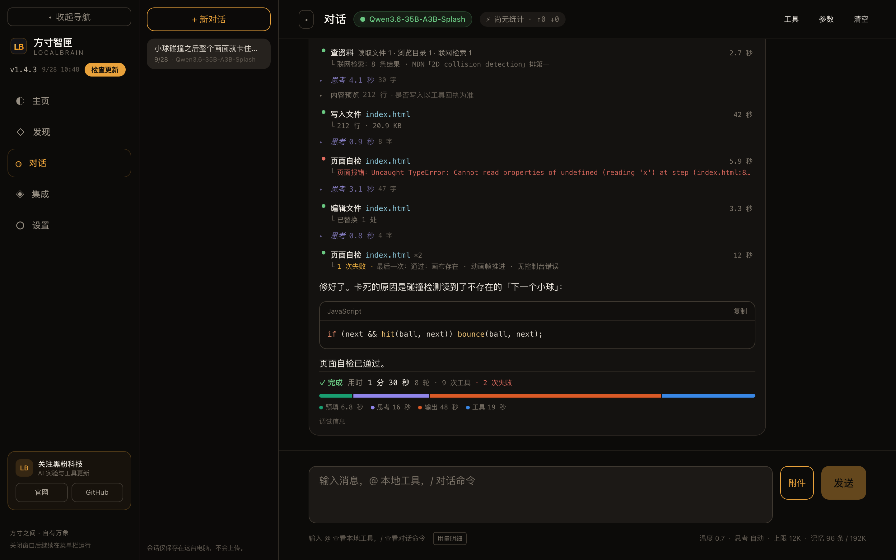
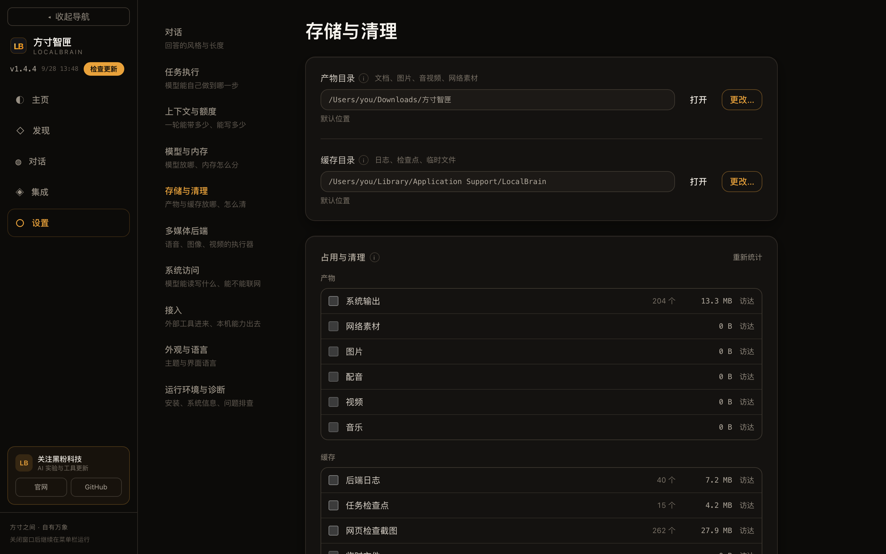

# 方寸智匣 · LocalBrain

**简体中文** · [繁體中文](README.zh-TW.md) · [English](README.en.md)

把电脑变成私有 AI 工作台：下载和管理本地模型，在对话里让模型读写文件、查资料、生成文档与多媒体，也能把这些本地能力接给 Claude Code、OpenCode、Codex 等客户端使用。

[官网](https://hyphentech.top/localbrain) · [全部版本](https://github.com/HackerChi-Hub/localbrain-releases/releases)



## 下载

[下载 Mac 1.4.6](https://github.com/HackerChi-Hub/localbrain-releases/releases/download/v1.4.6/LocalBrain_1.4.6_aarch64.dmg) · [Windows 1.4.4 下载页](https://github.com/HackerChi-Hub/localbrain-releases/releases/tag/v1.4.4)

Mac 安装包 SHA-256：`985b861294172fe5de9518dc9b04c2bf0daeb86ceb083ff938eeacde79e3f360`

- **Mac：1.4.6（正式版）**，适用于 Apple Silicon。1.4 系列新增「存储与清理」：生成的文件和缓存都能指定位置（包括外置盘）并彻底清理；自动收敛由程序后台定时执行，窗口隐藏时也照常清理。1.4.3 补齐了英文与繁体中文界面里残留的简体中文；1.4.4 让发现页的「使用已有」先核对所选文件夹里是不是这个模型，主页会列出指向已不存在目录的失效登记，并逐条审校了约 1400 条英文界面文字；1.4.5 新增「赞助」入口，侧栏和设置里随时能看到微信赞助码，任务完成后偶尔出现一张不打扰的邀请卡（每天最多一次，可关闭）。
- **Windows：1.4.4** 仍为当前已发布安装包。Windows 新安装包另行手动构建；Mac 版本号不代表 Windows 已更新。
- 应用内可以直接检查并安装更新，更新包带签名校验。

## 功能一览

### 本机总览：看得见的内存账

主页一屏说清三件事：这台机器是什么配置、现在谁在占内存、还能再开什么。

- **硬件与内存**：芯片、统一内存、可用磁盘、系统版本；内存条把占用拆成「系统」和「AI 模型」两段，剩余多少直接写出来。
- **运行中的服务**：每个后端标明预计占用的内存，随时停止。多个模型抢内存时，由仲裁器按剩余内存决定能不能开。
- **语言模型**：MLX、llama.cpp（GGUF）和 Splash 三种引擎用同一套启停方式。Splash 模型自带草稿模型做投机解码，能看图的模型会标出来。
- **多媒体后端**：语音转写、语音合成（含声音克隆）、图像生成、图像编辑、视频生成、音乐生成，各自按需启动；空闲一段时间或内存吃紧时自动释放。

### 发现模型：下载之前就知道能不能跑


- **精选目录**：40 多个条目，覆盖语言、视觉、语音、图像、视频和音乐模型，按加入时间排列。每张卡片写明能力标签、官方基准的原始数字和出处、各量化档位的体积，以及**按本机算出来的**最低和建议内存。
- **许可证提前说**：禁止商用这类比通常更严的限制，显示在下载按钮之前，并附原文链接。
- **下载源可选**：ModelScope、HF-Mirror 与 Hugging Face 官方，一键测速选最快的源。
- **挂载已有模型**：选中已经下载好的模型目录，自动识别引擎、类别与上下文能力，不复制权重、不改动源目录。

### 对话与任务：每一步都摆在明面上



让模型处理一个具体任务时，它调用工具一步步做（复杂任务会先列计划），过程全部展示：

- **工具**：读取和列出本地文件、联网检索网页、写入和逐处编辑文件、运行网页自检、处理 Word / Excel / PowerPoint / PDF。运行项目命令前每次都会弹窗确认，并说明工作目录限制不等于系统沙箱。
- **失败不藏**：同一工具的重复调用合并显示（如「页面自检 ×2 · 1 次失败」），失败原因原样保留。上图里模型第一次自检拿到页面报错，改了一行判空，再自检通过。
- **自检**：生成的网页会在无头浏览器里检查画布是否存在、动画帧是否推进、控制台有没有报错。
- **用时分账**：任务结束给出总用时、轮数、工具次数和失败次数，并把时间拆成预填、思考、输出、工具四段。
- **上下文管理**：按模型窗口和本机内存自动决定单次输出上限与带入的历史条数；超出预算的早期消息折叠成摘要，不会无限变长。

截图中的对话是演示内容；硬件、模型、体积与目录占用取自作者的 Mac（M5 Pro · 64 GB）。

### 存储与清理：不留隐形占用



- **两个目录都能换位置**：「产物目录」放生成的文档、图片、配音、视频、音乐和网络素材，「缓存目录」放日志、任务检查点、检查截图和临时文件。都可以改到任意位置，包括外置盘。
- **换位置自动搬家**：同一块盘直接移动；跨盘先复制、核对无误，再把旧的移进废纸篓。
- **按类别看占用、按类别清理**：默认进废纸篓，也可以选择彻底删除；进废纸篓的文件夹带上来源目录名，一眼认得出。
- **自动收敛**：日志总量、检查点天数、临时文件天数都有阈值，程序后台定时执行，窗口没打开也照常清理。

### 接入其它 AI 客户端


- **本地 MCP 工具**：把文档处理、语音转写、语音合成、图像、视频和联网研究作为工具，一键写入 Claude Code、OpenCode、Codex、DeepSeek Harness 的配置。只增改 `localbrain-*` 这几项，不动你的模型设置和其它 MCP；需要时一键恢复到写入前的原样。
- **本地模型当脑**：OpenCode、ScreenLex、DeepSeek Harness 可以通过本机的 OpenAI 兼容接口（`127.0.0.1:11434/v1`）直接使用本地模型，全程本地、不需要 API key。
- **自检**：检查 MCP 协议与工具发现是否正常，不加载模型、不占额外内存。

### 其它

- **提示词模板**：图像 8 个（人像、商品、透明底、局部编辑、换场景、人物＋商品合成、中文海报、中英混排）、视频 5 个（风景运镜、生活特写、首帧、首尾帧、多参考图），标出要改哪里、需要几张参考图和本机参考耗时。
- **文档工作台**：DocFactory 读取、创建、编辑 DOCX、PPTX、XLSX、PDF，支持模板填充与预览检查。
- **三种界面语言**：简体中文、繁体中文、英文，也可以跟随系统；只翻译界面，不改对话、模型回答、代码和文件路径。
- **可扩展**：可以接入你信任的本地 stdio MCP 服务器；四种界面主题。

## 平台差异

| 功能 | Apple Silicon Mac | Windows x64 |
|---|---|---|
| 语言模型 | MLX / llama.cpp（Metal） / Splash | llama.cpp（CUDA / CPU） |
| 对话、网页及文档工具 | 支持 | 支持 |
| 图像生成（torch / diffusers） | 支持（MPS） | 支持（CUDA），运行环境约 3 GB |
| 语音 / 视频 / 音乐后端 | 已支持的模型可用 | 不支持，隐藏相关入口 |
| 存储与清理 | 1.4.0 起 | 1.4.4 起 |

识别到模型文件不代表支持其架构；运行效果取决于模型、量化、运行时和硬件。

## 开始使用

1. 下载对应平台的安装包。Mac 把应用拖进「应用程序」；Windows 运行安装程序。
2. 在「设置」安装所需的运行环境，选择界面语言、模型目录和下载来源。
3. 在「发现」下载合适的模型，或挂载已有的模型目录。
4. 在「主页」启动语言模型，到「对话」使用；通过「集成」把本地能力接给其它客户端。

## 隐私与网络

推理在本机进行，对话只保存在这台电脑上。首次下载模型、安装运行环境、检查更新和联网检索需要网络；只有你明确加入的外部模型目录才会被读取；切换界面语言不会把对话发给任何翻译服务。

## 开发

本仓库只提供安装包和使用说明。以下命令面向已获得源码的开发者，不能在本下载仓库直接执行。

React / TypeScript / Vite 前端，Tauri / Rust 桌面层。

```bash
npm install
npm test
npm run build
npm run tauri:dev
```

Mac：`npm run package`。Windows：在 Windows 上运行 `npm run package:win`。发布前检查安装包、签名、线上下载和分平台更新清单。

词典位于 `src/locales/`，只处理显示文案，不修改提示词、工具参数或用户内容。

## 许可

专有软件。模型遵守各自许可；应用下载不包含模型权重。© HyphenTech · 黑粉科技。
