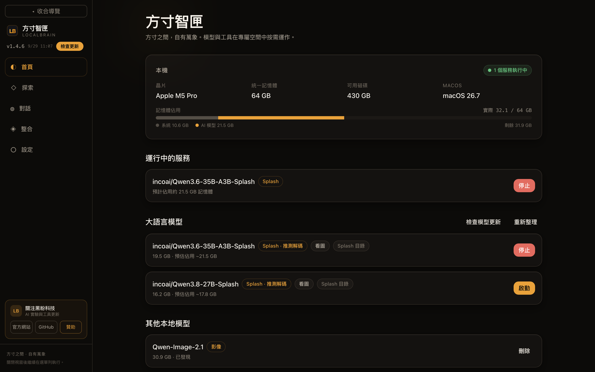
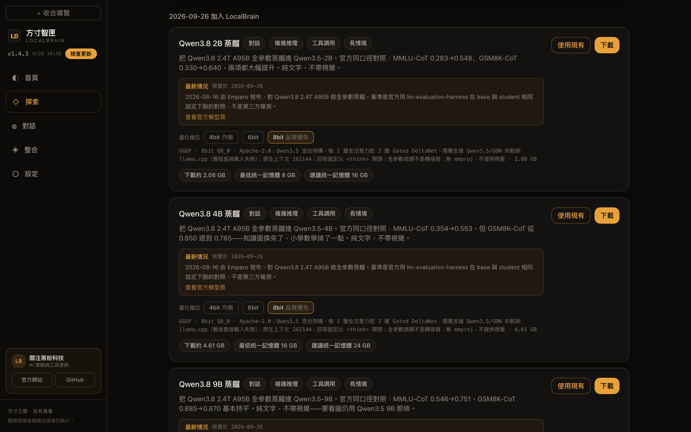
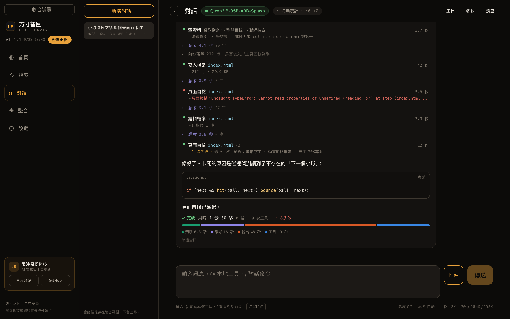
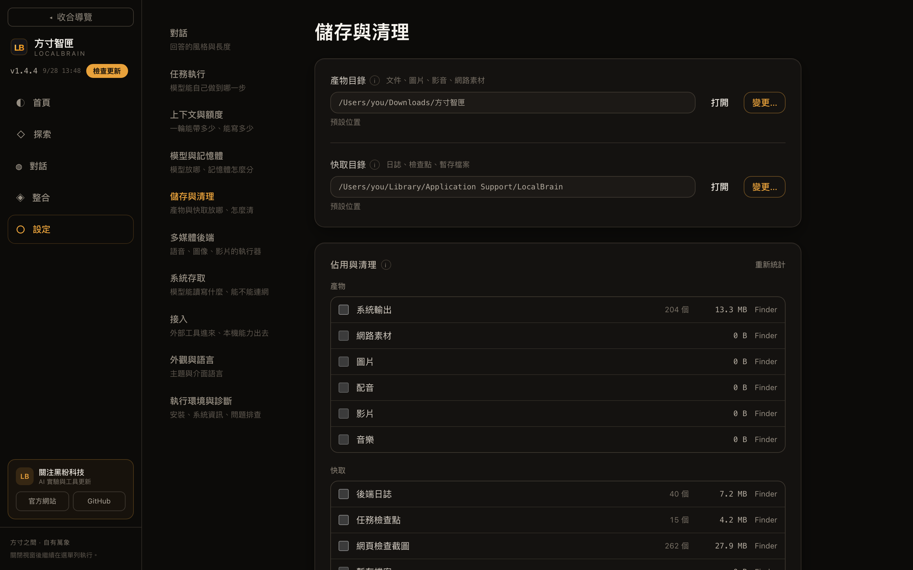
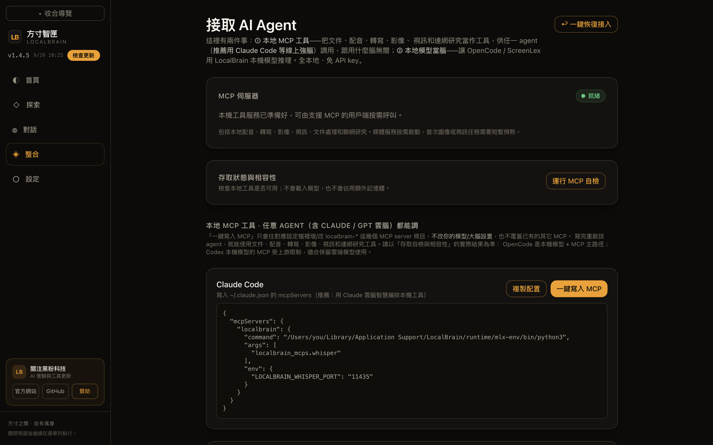

# 方寸智匣 · LocalBrain

[简体中文](README.md) · **繁體中文** · [English](README.en.md)

把電腦變成私有 AI 工作台：下載和管理本機模型，在對話裡讓模型讀寫檔案、查資料、產生文件與多媒體，也能把這些本機能力接給 Claude Code、OpenCode、Codex 等客戶端使用。

[官網](https://hyphentech.top/localbrain) · [全部版本](https://github.com/HackerChi-Hub/localbrain-releases/releases)



## 下載

[下載 Mac 1.4.9](https://github.com/HackerChi-Hub/localbrain-releases/releases/download/v1.4.9/LocalBrain_1.4.9_aarch64.dmg) · [Windows 1.4.8 下載頁](https://github.com/HackerChi-Hub/localbrain-releases/releases/tag/v1.4.8)

Mac 安裝包 SHA-256：`ffffeb30949db75da1f881e663109e94c0bcb62c7a419c0adb394ddb5c1c48a1`

- **Mac：1.4.9（正式版）**，適用於 Apple Silicon。1.4 系列新增「儲存與清理」：產生的檔案和快取都能指定位置（包括外接硬碟）並徹底清理；自動收斂由程式在背景定時執行，視窗隱藏時也照常清理。1.4.3 補齊了英文與繁體中文介面裡殘留的簡體中文；1.4.4 讓探索頁的「使用現有」先核對所選資料夾裡是不是這個模型，首頁會列出指向已不存在目錄的失效登記，並逐條審校了約 1400 條英文介面文字；1.4.5 新增「贊助」入口，側欄和設定裡隨時能看到微信贊助碼，任務完成後偶爾出現一張不打擾的邀請卡（每天最多一次，可關閉）；1.4.6 起產生圖片、影片、音訊和產出文件也算一次任務，邀請卡要等產生視窗關上才出現。1.4.7 起文件能直接產生 Markdown、HTML、TXT、RTF、ODT、EPUB，內容先清洗再寫成檔案；新增「存取網路裝置」（HTTP + SSH，預設關閉）。1.4.8 新增第二個本機影片引擎 LTX-2.5：以文字、首幀、首尾幀產生帶同步立體聲的影片，寫在引號裡的台詞會被唸出來，時長 1～30 秒（單次 10 秒，更長的自動接力）；探索頁一鍵下載 43.4 GB，中國大陸選 ModelScope 直連。
- **1.4.9 新增**：Swift 1.5 的 Splash 社群轉換版（約 17.4 GB）；LTX-2.5 下載可選擇 4bit（27.2 GB）、8bit（43.4 GB）或 BF16（71 GB），各檔獨立辨識安裝狀態；Splash 安裝失敗保留受限長度的具體診斷。
- **Windows：1.4.8** 仍為目前已發布的安裝包。Windows 新安裝包另行手動建置；Mac 版本號不代表 Windows 已更新。
- 應用程式內可以直接檢查並安裝更新，更新包帶簽章校驗。

## 功能一覽

### 本機總覽：看得見的記憶體帳

首頁一屏說清三件事：這台機器是什麼配置、現在誰在佔記憶體、還能再開什麼。

- **硬體與記憶體**：晶片、統一記憶體、可用磁碟、系統版本；記憶體條把佔用拆成「系統」和「AI 模型」兩段，剩餘多少直接寫出來。
- **執行中的服務**：每個後端標明預計佔用的記憶體，隨時停止。多個模型搶記憶體時，由仲裁器依剩餘記憶體決定能不能開。
- **語言模型**：MLX、llama.cpp（GGUF）和 Splash 三種引擎用同一套啟停方式。Splash 模型自帶草稿模型做推測解碼，能看圖的模型會標出來。
- **多媒體後端**：語音轉寫、語音合成（含聲音克隆）、影像產生、影像編輯、影片產生、音樂產生，各自按需啟動；閒置一段時間或記憶體吃緊時自動釋放。

### 探索模型：下載之前就知道能不能跑



- **精選目錄**：40 多個條目，涵蓋語言、視覺、語音、影像、影片和音樂模型，依加入時間排列。每張卡片寫明能力標籤、官方基準的原始數字和出處、各量化檔位的體積，以及**依本機算出來的**最低和建議記憶體。
- **授權提前說**：禁止商用這類比通常更嚴的限制，顯示在下載按鈕之前，並附原文連結。
- **下載來源可選**：ModelScope、HF-Mirror 與 Hugging Face 官方，一鍵測速選最快的來源。
- **掛載已有模型**：選中已經下載好的模型目錄，自動識別引擎、類別與上下文能力，不複製權重、不改動來源目錄。

### 對話與任務：每一步都擺在明面上



讓模型處理一個具體任務時，它呼叫工具一步步做（複雜任務會先列計畫），過程全部顯示：

- **工具**：讀取和列出本機檔案、聯網檢索網頁、寫入和逐處編輯檔案、執行網頁自檢、處理 Word / Excel / PowerPoint / PDF。執行專案命令前每次都會跳出確認，並說明工作目錄限制不等於系統沙箱。
- **失敗不藏**：同一工具的重複呼叫合併顯示（如「頁面自檢 ×2 · 1 次失敗」），失敗原因原樣保留。上圖裡模型第一次自檢拿到頁面報錯，改了一行判空，再自檢通過。
- **自檢**：產生的網頁會在無頭瀏覽器裡檢查畫布是否存在、動畫影格是否推進、主控台有沒有錯誤。
- **用時分帳**：任務結束給出總用時、輪數、工具次數和失敗次數，並把時間拆成預填、思考、輸出、工具四段。
- **上下文管理**：依模型視窗和本機記憶體自動決定單次輸出上限與帶入的歷史則數；超出預算的早期訊息摺疊成摘要，不會無限變長。

截圖中的對話是示範內容；硬體、模型、體積與目錄佔用取自作者的 Mac（M5 Pro · 64 GB）。

### 儲存與清理：不留隱形佔用



- **兩個目錄都能換位置**：「產物目錄」放產生的文件、圖片、配音、影片、音樂和網路素材，「快取目錄」放日誌、任務檢查點、檢查截圖和暫存檔案。都可以改到任意位置，包括外接硬碟。
- **換位置自動搬家**：同一顆硬碟直接移動；跨硬碟先複製、核對無誤，再把舊的移到垃圾桶。
- **依類別看佔用、依類別清理**：預設移到垃圾桶，也可以選擇永久刪除；移到垃圾桶的資料夾帶上來源目錄名，一眼認得出。
- **自動收斂**：日誌總量、檢查點天數、暫存檔天數都有門檻，程式在背景定時執行，視窗沒開也照常清理。

### 接入其他 AI 客戶端



- **本機 MCP 工具**：把文件處理、語音轉寫、語音合成、影像、影片和聯網研究作為工具，一鍵寫入 Claude Code、OpenCode、Codex、DeepSeek Harness 的設定。只增改 `localbrain-*` 這幾項，不動你的模型設定和其他 MCP；需要時一鍵恢復到寫入前的原樣。
- **本機模型當腦**：OpenCode、ScreenLex、DeepSeek Harness 可以透過本機的 OpenAI 相容介面（`127.0.0.1:11434/v1`）直接使用本機模型，全程本機、不需要 API key。
- **自檢**：檢查 MCP 協定與工具發現是否正常，不載入模型、不佔額外記憶體。

### 其他

- **提示詞範本**：影像 8 個（人像、商品、透明底、局部編輯、換場景、人物＋商品合成、中文海報、中英混排）、影片 5 個（風景運鏡、生活特寫、首幀、首尾幀、多參考圖），標出要改哪裡、需要幾張參考圖和本機參考耗時。
- **文件工作台**：DocFactory 讀取、建立、編輯 DOCX、PPTX、XLSX、PDF，支援範本填充與預覽檢查。
- **三種介面語言**：簡體中文、繁體中文、英文，也可以跟隨系統；只翻譯介面，不改對話、模型回答、程式碼和檔案路徑。
- **可擴充**：可以接入你信任的本機 stdio MCP 伺服器；四種介面主題。

## 平台差異

| 功能 | Apple Silicon Mac | Windows x64 |
|---|---|---|
| 語言模型 | MLX / llama.cpp（Metal） / Splash | llama.cpp（CUDA / CPU） |
| 對話、網頁及文件工具 | 支援 | 支援 |
| 影像產生（torch / diffusers） | 支援（MPS） | 支援（CUDA），執行環境約 3 GB |
| 語音 / 影片 / 音樂後端 | 已支援的模型可用 | 不支援，隱藏相關入口 |
| 儲存與清理 | 1.4.0 起 | 1.4.4 起 |

識別到模型檔案不代表支援其架構；執行效果取決於模型、量化、執行環境和硬體。

## 開始使用

1. 下載對應平台的安裝包。Mac 把應用程式拖進「應用程式」；Windows 執行安裝程式。
2. 在「設定」安裝所需的執行環境，選擇介面語言、模型目錄和下載來源。
3. 在「探索」下載合適的模型，或掛載已有的模型目錄。
4. 在「首頁」啟動語言模型，到「對話」使用；透過「整合」把本機能力接給其他客戶端。

## 隱私與網路

推理在本機進行，對話只保存在這台電腦上。首次下載模型、安裝執行環境、檢查更新和聯網檢索需要網路；只有你明確加入的外部模型目錄才會被讀取；切換介面語言不會把對話傳給任何翻譯服務。

## 開發

本倉庫只提供安裝包和使用說明。以下命令面向已取得原始碼的開發者，不能在本下載倉庫直接執行。

React / TypeScript / Vite 前端，Tauri / Rust 桌面層。

```bash
npm install
npm test
npm run build
npm run tauri:dev
```

Mac：`npm run package`。Windows：在 Windows 上執行 `npm run package:win`。發布前檢查安裝包、簽章、線上下載和分平台更新清單。

詞典位於 `src/locales/`，只處理顯示文案，不修改提示詞、工具參數或使用者內容。

## 授權

專有軟體。模型遵守各自授權；應用程式下載不包含模型權重。© HyphenTech · 黑粉科技。
